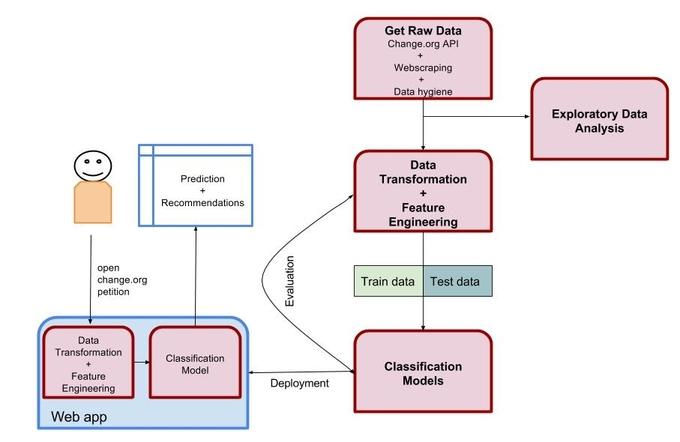

# BeTheChange

*"Be the change you wish to see in the world."*

### Motivation

Since 2007 Change.org has been helping people make their voice count. Some users succeed in collecting the
number of signatures needed and some of those have resulted in a real impact in the world. Others, do not.
The motivation for this capstone project is to find the actionable features of the change.org petitions.
This information will help future users improve their chances of attracting the required signatures.
While looking for ideas, I knew that I wanted my project to be original and beneficial for society. After doing some
research I chose this project because it fulfills both those requirements. This project has not been
done before and will be a useful tool for anyone who wants to effect change through change.org.
My primary research questions are two-fold:
What features are most important? Does politics play a role in the outcome of the petitions?

### Business Understanding

With this project we want to answer the following questions:

* Can we predict whether a change.org petition will collect the target number of signatures?
* Can we help petitioners craft more successful petitions?
* Can we predict if a petition with enough signatures will succeed?

Given time restrictions the project scope will be limited to:

* Petitions made to the US government.
* Train the model with closed petitions from 2010 to 2016.

### Pipeline overview

Following CRISP-DM we can describe part of the process in the following image:

### Collecting the data

Getting the data was one of the biggest challenges of this project since change.org
 doesn't make it easy: 
    * Change.org has a [API](https://github.com/change/api_docs) but it is deprecated. 
    * Tha API only retrieves information for a petition by ID.
    * You can not search petitions through the API.
    * Pure web scraping was not possible, change.org only shows open petitions and 
     victories, but there is no way to search by country or dates.
    * I considered using the google search api to get a list all the published 
     change.org petitions, but, google API is limited to the first 100 results. 
    * Petitions have an ID that seems to be generated as a digit number correlatively
     from 5 digits number to 6 digits numbers. 
So, my initial approach was to write a [crawler](https://github.com/nmoraesmunter/BeTheChange/blob/master/src/collectors/api/changeorg/petitions_crawler.py) to call the deprecated change.org API with the generated 
ID numbers (some of them failed) and collect the basic information for each petitions.
I used multiprocessing in EC2 instances to accelerate this process.
This way I got around 3,000,000 petitions (all petitions generated over the world) in json 
format stored in my MongoDB.
For the project I used the closed petitions (successes and failures) made to the US, around 50,000.
Given this data I [webscraped](https://github.com/nmoraesmunter/BeTheChange/blob/master/src/collectors/data_collector.py) more detailed data for each petition. 
And I also [webscraped the political party](https://github.com/nmoraesmunter/BeTheChange/blob/master/src/collectors/data_collector.py) for each decision maker through ballotpedia.com
  
 

### Data Understanding

Only 2,000 petitions of the 50,000 were closed as victories by the user,
and only 1,000 were final implemented changes confirmed by change.org.
Given this ratio we see that one of the challenges will be to deal with
the huge class imbalancement.

Another problem is the blurriness of the concept Victory. After analyzing the
data, I could observe that Victory was not equivalent
to get the targeted number of signatures. Victory is a status set but the user 
and proof of victory is not required. Confirmed Victory is neither equivalent
to get the 100% of the goal. I assume that there are petitions that also 
make signatures collections offline.

### Data Preparation

1. [Clean data](https://github.com/nmoraesmunter/BeTheChange/blob/master/notebooks/clean_data.ipynb)
2. [Feature engineering](https://github.com/nmoraesmunter/BeTheChange/blob/master/src/preprocess/data_pipeline.py)
3. You can find the [scraped](	
https://s3-us-west-2.amazonaws.com/bethechangeorg/petitions_scraped.json) and [featured data](https://s3-us-west-2.amazonaws.com/bethechangeorg/featured_petitions.json) in S3

### Modeling

1. Split data in training set (70%) and test set (30%)
2. Building [model pipeline](https://github.com/nmoraesmunter/BeTheChange/blob/master/src/model/model_pipeline.py) using sklearn Pipeline. 
3. Applied [NLP](https://github.com/nmoraesmunter/BeTheChange/blob/master/src/model/similarities_pipeline.py) on the description and did Feature Union in the mentioned pipeline.
4. Tried different classification models(LogisticRegression, RandomForest, AdaBoost, SGDBoost, SVM...)
5. Settled up with RandomForest and AdaBoost
6. Calibrate parameters to optimal values applying GridSearch over the Pipeline.

### Evaluation

1. Cross-validation
2. Review the steps
3. Determine if there are other features that have not been considered

### Deployment

1. Build web app to show results and add functionality to predict success of a new petition
2. Add functionality of showing similar petitions.
3. Add some interactive visualizations (unfinished)

http://bethechange.rocks/

### Presentation

https://docs.google.com/presentation/d/1_d4bupIu_A5mwM0lFnpAxrtY53IASyOmPd3bQCzHlUM/edit?usp=sharing

### Tech stack

Python
    * Sklearn
    * Pandas
    * Numpy
    * BeautifulSoup
    * Multiprocessing
    * Flask

AWS
    * EC2
    * S3

MongoDB

### Code walk-through

### How to run it

