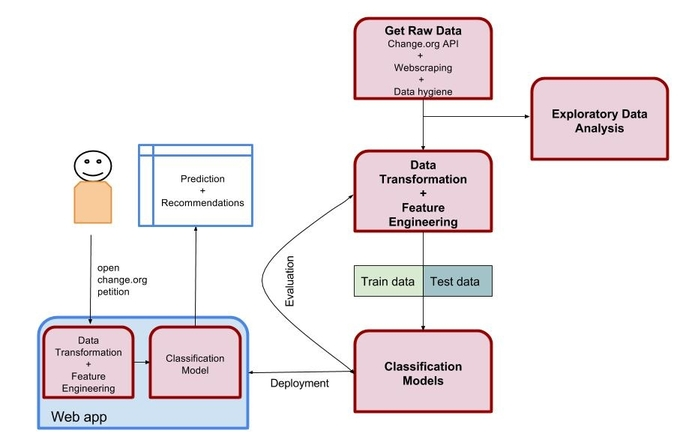

# BeTheChange

### Motivation

Since 2007 Change.org has been helping people to make their voice count. Some of them have succeeded in collecting the
needed number of signatures and some of those have been able resulted in a real change. The motivation for this
capstone project is to find the actionable features of the change.org petitions and help users improve them and succeed.
While looking for ideas I knew that I wanted my project to be original and meaningful socially or
environmentally. After doing some research I chose this project given it fulfills those requirements. It has not been
done before and it is a way to help people who want to help. I wonder what the insights of the data will be.
What features are the most important? Does politics have a role in the outcome of the petitions?

*"Be the change you wish to see in the world."*

### Business Understanding

With this project we want to answer the following questions:

* Can we predict whether a change.org petition can collect the target number of signatures?
* Can we help petitioners craft more successful petitions?
* Can we predict if a petition with enough signatures will succeed?

Given the time restrictions the project scope will be limited to:

* Petitions made to the US government.
* Train the model with closed petitions from 2010 to 2016.

### Pipeline overview

Following CRISP-DM we can describe part of the process in the following image:

### Data Understanding

To understand the data, first of all we need to get the data.

1. Get all petitions through change.org API using a crawler that generates all possible petitions ID's between 5 and 6 digits.
    * Store in json format in a MongoDB in S3.
    * It has not been possible to gather data earlier than 2010.
    * Total number of petitions:
2. Filter:
    * Petitions made to the US government.
    * Status is closed or victory.
        * Preview and open status are not included because they are not labeled.
    * Total number of petitions after filtering:
3. Get user/organization information through API.
    * Store in json format in a MongoDB in S3.
4. Save the whole html for each petition in MongoDB.
    * Store in html format in a MongoDB in S3.
5. Analyze content of html and discover first insights.
6. Decide what content to extract, for example:
    * Petition text
    * Topic
    * Letter
    * Hashtag if included
    * Number of updates
    * List of "supported by"
    * Weekly signature count
    * Is victory
    * Is verified victory
    * Victory date
    * Is pledge
    * Has fundraiser
    * Embedded tweets
        * Get number of retweets and likes through Twitter API
    * Number of comments
7. Webscrape mentioned data using BeautifulSoup.
8. Get political history by state between 2010 and 2016.
    * Who was in power.
9. Data hygiene.
10. Get random sample to start playing with.
11. Exploratory Data Analysis.

### Data Preparation

1. Clean data:
    * Missing data
    * Outliers
2. Feature engineering.

### Modeling

1. Split data in training set (70%) and test set (30%).
2. NLP.
3. Try different classification models(RandomForest, AdaBoost, SGDBoost, SVM...).
4. Calibrate parameters to optimal values.

### Evaluation

1. Cross-validation.
2. Review the steps.
2. Determine if there are other features that have not been considered.

### Deployment

1. Build web app to show results and add functionality to predict success of a new petition.
2. Add some interactive visualizations.

